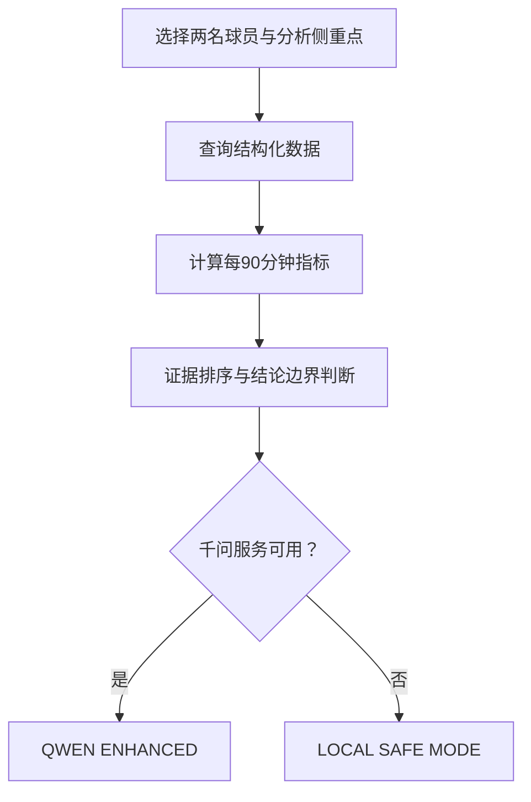

# 英超智析 Agent | Premier League Insight Agent

> 面向中文英超球迷与内容创作者的垂直足球数据分析助手  
> 将球队、球员与比赛数据转化为可查询、可比较、可解释的分析结论。

**当前版本：`v0.5.0 · Stadium Explorer`**

**项目状态：MVP 开发中**

## 项目简介

Premier League Insight Agent 是一个结合足球数据工程、Web 开发与大模型应用的英超数据分析项目。

系统通过数据库查询、每 90 分钟指标计算、证据排序和结论边界判断生成结构化分析，并使用通义千问进一步组织自然语言回答。千问不可用时，系统会自动切换至本地安全分析模式。

项目由数据科学与大数据技术专业学生独立开发，主要用于比赛展示、GitHub 项目积累与足球数据分析实践。

## 当前功能

| 模块 | 已实现能力 |
|---|---|
| 数据库 | 球队、球员、积分榜、比赛与事件关系模型 |
| 数据 API | 球队列表、球队详情、积分榜等查询接口 |
| 球场地图 | 英格兰交互地图、球场标记、球队列表联动与定位动画 |
| 球队详情 | 从地图进入球队资料页，展示球场信息与样例阵容 |
| 球员分析 | 双球员比较、每 90 分钟指标与四种分析侧重点 |
| Agent 工具链 | 意图识别、数据查询、指标计算、证据排序与结论生成 |
| 千问增强 | 接入 `qwen-plus`，生成更自然的中文足球分析 |
| 安全降级 | 千问不可用时自动进入 `LOCAL SAFE MODE` |
| 前端交互 | 分析任务入口、加载状态、错误提示与重新尝试 |
| 工程能力 | 数据库迁移、统一响应结构、自动化测试与环境变量管理 |

当前数据库包含 **6 支球队、12 名球员及积分榜样例切片**，用于验证完整的数据分析流程。

## Agent 工作流程



千问主要负责组织和解释已经计算出的证据，不直接替代数据库查询与指标计算。

## 技术栈

| 层级 | 技术 |
|---|---|
| 前端 | Next.js、React、TypeScript、Tailwind CSS、React Leaflet |
| 地图 | Leaflet、OpenStreetMap 标准瓦片 |
| 后端 | Python、FastAPI、Pydantic |
| 数据层 | SQLite、SQLAlchemy、Alembic |
| AI 能力 | 通义千问 OpenAI-compatible API、`qwen-plus` |
| 测试与质量 | Pytest、ESLint、Next.js Build |
| 版本管理 | Git、GitHub |

## 本地运行

### 1. 克隆项目

```powershell
git clone https://github.com/ruiyangxie434-byte/premier-league-insight-agent.git
cd premier-league-insight-agent
```

### 2. 启动后端

```powershell
cd backend
python -m venv .venv
.\.venv\Scripts\Activate.ps1
python -m pip install -r requirements.txt
Copy-Item .env.example .env
python -m uvicorn app.main:app
```

后端启动成功后访问：

- API 地址：`http://127.0.0.1:8000`
- API 文档：`http://127.0.0.1:8000/docs`

### 3. 启动前端

新建一个终端，在项目根目录运行：

```powershell
cd frontend
npm install
npm run dev
```

浏览器访问：

```text
http://localhost:3000
```

## 地图配置

地图默认使用 OpenStreetMap 标准瓦片，并在地图内显示数据署名。需要切换合规的地图瓦片服务时，可在 `frontend/.env` 中设置：

```dotenv
NEXT_PUBLIC_MAP_TILE_URL=https://tile.openstreetmap.org/{z}/{x}/{y}.png
```

球队与球场坐标始终来自后端 `/api/clubs`，前端地图没有重复硬编码业务坐标。

## 千问配置

项目未配置千问 API Key 时仍可运行，并自动使用本地安全分析模式。

如需启用千问增强：

1. 复制 `backend/.env.example` 为 `backend/.env`。
2. 按照示例文件填写自己的千问 API Key。
3. 不要将 `.env` 或真实 API Key 上传到 GitHub。

分析结果页面会显示当前模式：

- `QWEN ENHANCED`：千问调用成功。
- `LOCAL SAFE MODE`：正在使用本地分析结果。

## 项目测试

后端测试：

```powershell
cd backend
python -m pytest
```

前端检查：

```powershell
cd frontend
npm run lint
npm run build
```

`v0.5.0` 阶段验收结果：

- 后端：15 项测试通过
- 前端：Lint 通过
- 前端：Production Build 通过
- 首页与球队详情动态路由构建通过
- 默认启动、球队列表与球队详情接口验证通过

## 版本进度

- [x] `v0.1.0` 前后端项目骨架与健康检查
- [x] `v0.2.0` SQLite 数据层、关系模型与基础 API
- [x] `v0.3.0` 双球员分析 Agent MVP
- [x] `v0.4.0` 通义千问增强与本地安全降级
- [x] `v0.5.0` 英格兰交互地图与球队球场探索
- [ ] 扩展至完整 20 支英超球队
- [ ] 球员雷达图与更多可视化
- [ ] 接入真实、可追溯的比赛数据
- [ ] 示例比赛事件与空间分析
- [ ] 在线部署与移动端优化

## 数据说明

当前版本主要使用示例数据验证系统结构和分析流程，并非完整或实时英超数据。

项目不会将示例数据描述为官方实时数据；后续将逐步接入具有明确来源和更新时间的公开足球数据。

## 当前边界

当前 MVP 暂不包含：

- 用户注册与登录
- 新闻资讯
- 实时比分推送
- 比赛结果预测
- 完整历史赛季
- 无依据的自由问答

项目当前重点是完成一条可靠的流程：

```text
结构化数据 → 指标计算 → 证据排序 → 结论边界 → 千问解释
```

## 项目定位

本项目不仅是一个英超信息展示网站，更是一项覆盖以下能力的综合实践：

- 足球数据建模与数据库设计
- 后端 API 开发
- 数据清洗与衍生指标计算
- Agent 工具链设计
- 大模型安全接入
- 前后端交互与工程测试

---

如果你对项目有建议，欢迎提交 Issue。

**Premier League Insight Agent is under active development.**
