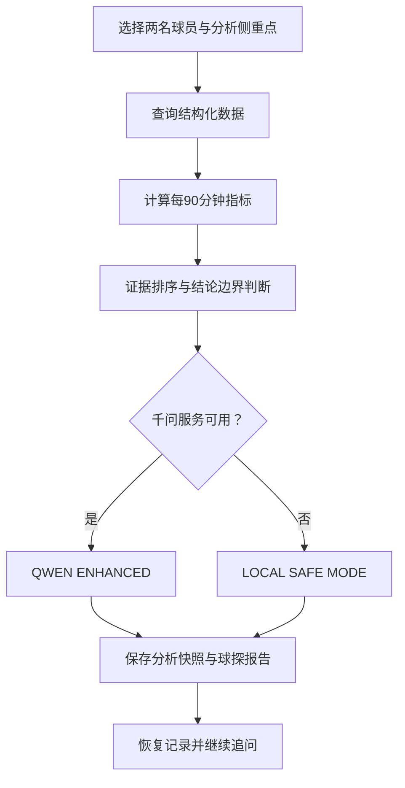

# 英超智析 Agent | Premier League Insight Agent

> 面向中文英超球迷与内容创作者的垂直足球数据分析助手  
> 将球队、球员与比赛数据转化为可查询、可比较、可解释的分析结论。

**当前版本：`v0.9.0 · Agent Notebook`**

**项目状态：MVP 开发中**

## 项目简介

Premier League Insight Agent 是一个结合足球数据工程、Web 开发与大模型应用的英超数据分析项目。

系统通过数据库查询、每 90 分钟指标计算、证据排序和结论边界判断生成结构化分析，并使用通义千问进一步组织自然语言回答。千问不可用时，系统会自动切换至本地安全分析模式。

项目由数据科学与大数据技术专业学生独立开发，主要用于比赛展示、GitHub 项目积累与足球数据分析实践。

## 当前功能

| 模块 | 已实现能力 |
|---|---|
| 数据库 | 球队、球员、积分榜、比赛、事件与 Agent 分析记录关系模型 |
| 数据 API | 球队、积分榜、球员、历史比赛事件与分析记录查询接口 |
| 球场地图 | 2024-25 完整 20 队、球场搜索、标记联动与定位动画 |
| 球队详情 | 20 支球队均可从地图进入资料页，缺少球员样例时显示明确空状态 |
| 完整积分榜 | 2024-25 最终 20 队积分榜、十列排序、冠军/欧冠/降级标记 |
| 球员数据中心 | 球员搜索、球队/位置/分钟筛选、十列排序与详情页 |
| 球员可视化 | 后端统一计算每 90 分钟指标、位置感知百分位与单人/双人雷达图 |
| 球员分析 | 双球员比较、四种分析侧重点与 Player Lab 选择联动 |
| 比赛数据管道 | StatsBomb Open Data 清洗脚本、坐标归一化、来源 ID 与幂等导入 |
| Match Lab | Arsenal 4–2 Liverpool 的 28 次射门、xG 对比、筛选、进球时间线与事件清单 |
| Agent 工具链 | 意图识别、数据查询、指标计算、证据排序与结论生成 |
| Agent Notebook | 自动保存分析、最近记录、历史恢复、父子追问链与上下文轨迹 |
| 球探报告 | 独立报告页、指标表、证据链、来源边界及打印 / 保存 PDF |
| 千问增强 | 接入 `qwen-plus`，生成更自然的中文足球分析 |
| 安全降级 | 千问不可用时自动进入 `LOCAL SAFE MODE` |
| 前端交互 | 分析任务入口、加载状态、错误提示与重新尝试 |
| 工程能力 | 数据库迁移、统一响应结构、自动化测试与环境变量管理 |

当前数据库包含 **20 支球队、20 条最终积分榜记录、12 名球员样例、1 场公开历史比赛和 28 次射门事件**，并保存本机生成的 Agent 分析快照。球队、积分榜和球员样例使用 2024-25 口径；比赛事件是 2003/2004 独立历史快照，两个赛季不会合并计算。

## Agent 工作流程



千问主要负责组织和解释已经计算出的证据，不直接替代数据库查询与指标计算。

## 技术栈

| 层级 | 技术 |
|---|---|
| 前端 | Next.js、React、TypeScript、Tailwind CSS、React Leaflet |
| 地图 | Leaflet、OpenStreetMap 标准瓦片 |
| 后端 | Python、FastAPI、Pydantic |
| 数据层 | SQLite、SQLAlchemy、Alembic |
| 公开事件数据 | StatsBomb Open Data |
| AI 能力 | 通义千问 OpenAI-compatible API、`qwen-plus` |
| 测试与质量 | Pytest、ESLint、Next.js Build |
| 版本管理 | Git、GitHub |

## 本地运行

### 1. 克隆项目

```powershell
git clone https://github.com/ruiyangxie434-byte/premier-league-insight-agent.git
cd premier-league-insight-agent
```

### 2. 启动后端

```powershell
cd backend
python -m venv .venv
.\.venv\Scripts\Activate.ps1
python -m pip install -r requirements.txt
Copy-Item .env.example .env
python -m uvicorn app.main:app
```

后端启动成功后访问：

- API 地址：`http://127.0.0.1:8000`
- API 文档：`http://127.0.0.1:8000/docs`

### 3. 启动前端

新建一个终端，在项目根目录运行：

```powershell
cd frontend
npm install
npm run dev
```

浏览器访问：

```text
http://localhost:3000
```

## 地图配置

地图默认使用 OpenStreetMap 标准瓦片，并在地图内显示数据署名。需要切换合规的地图瓦片服务时，可在 `frontend/.env` 中设置：

```dotenv
NEXT_PUBLIC_MAP_TILE_URL=https://tile.openstreetmap.org/{z}/{x}/{y}.png
```

球队与球场坐标始终来自后端 `/api/clubs`，前端地图没有重复硬编码业务坐标。地图侧栏支持按球队、城市或球场搜索。

## 球员数据中心

访问 `http://localhost:3000/players` 可以：

- 搜索球员、球队或国籍；
- 按球队、位置与最低出场分钟筛选；
- 按累计数据或每 90 分钟指标排序；
- 选择两名球员生成位置感知百分位雷达；
- 进入球员详情，查看累计数据、每90指标和百分位条；
- 把所选两名球员直接带入现有 Agent 继续分析。

雷达图优先使用同位置合格样例；同位置少于 3 人时回退到全部合格样例，并显示真实比较人数。详细公式和边界见 [`docs/PLAYER_LAB.md`](docs/PLAYER_LAB.md)。

## 比赛实验室

访问 `http://localhost:3000/matches` 可以：

- 打开 Arsenal 4–2 Liverpool（2004-04-09）公开历史事件快照；
- 对比双方射门、总 xG、实际进球与 `Goals - xG`；
- 按球队或进球结果筛选 28 次射门；
- 在进攻半场图上按 xG 大小查看射门位置；
- 点击射门查看球员、时间、结果、身体部位和进攻方式；
- 通过 6 个进球重建比赛时间线；
- 直接查看原始事件 JSON、开放数据许可和解释边界。

原始坐标从 StatsBomb `120 × 80` 归一化至 `0–100`。清洗脚本、公式、API 与赛季边界见 [`docs/MATCH_LAB.md`](docs/MATCH_LAB.md)。

## Agent Notebook 与球探报告

首页 Agent 工作台会自动保存每次完成的分析。用户可以：

- 在最近记录中重新打开任意分析；
- 继承同一组球员与赛季继续追问，并按新问题重新计算指标；
- 查看父记录、追问深度和 `run_memory` 工具轨迹；
- 打开 `/reports/{run_id}` 查看独立球探报告；
- 通过浏览器打印功能保存为 PDF，报告保留指标、证据、来源和结论边界。

记录目前只保存在项目连接的 SQLite 数据库中，不包含登录、云同步或跨用户共享。接口、数据模型和边界见 [`docs/AGENT_NOTEBOOK.md`](docs/AGENT_NOTEBOOK.md)。

## 千问配置

项目未配置千问 API Key 时仍可运行，并自动使用本地安全分析模式。

如需启用千问增强：

1. 复制 `backend/.env.example` 为 `backend/.env`。
2. 按照示例文件填写自己的千问 API Key。
3. 不要将 `.env` 或真实 API Key 上传到 GitHub。

分析结果页面会显示当前模式：

- `QWEN ENHANCED`：千问调用成功。
- `LOCAL SAFE MODE`：正在使用本地分析结果。

## 项目测试

后端测试：

```powershell
cd backend
python -m pytest
```

前端检查：

```powershell
cd frontend
npm run lint
npm run build
```

`v0.9.0` 阶段验收项目：

- 后端：29/29 测试通过，覆盖原有功能、记录保存、历史恢复、追问链与 404 边界
- 前端：Lint 通过
- 前端：TypeScript 通过
- 前端：Production Build 通过
- Alembic 可从空库顺序升级至 `20260808_0003`，旧数据无需删除
- 首页、报告页、比赛中心、比赛详情、球员中心、球队详情与球员详情路由构建通过

## 版本进度

- [x] `v0.1.0` 前后端项目骨架与健康检查
- [x] `v0.2.0` SQLite 数据层、关系模型与基础 API
- [x] `v0.3.0` 双球员分析 Agent MVP
- [x] `v0.4.0` 通义千问增强与本地安全降级
- [x] `v0.5.0` 英格兰交互地图与球队球场探索
- [x] `v0.6.0` 完整 20 队、可排序最终积分榜与数据来源说明
- [x] `v0.7.0` Player Lab、球员详情、每90数据榜与双人雷达图
- [x] `v0.8.0` 公开比赛数据管道、射门图、xG 对比与进球时间线
- [x] `v0.9.0` Agent 分析记录、上下文追问与可打印球探报告
- [ ] 球队赛季汇总、近期赛果与完整阵容
- [ ] 在线部署与移动端优化

## 数据说明

当前版本的球队范围和 2024-25 最终积分榜是完整历史快照；球员及赛季分析指标仍使用 12 名演示样例。Match Lab 单独使用 StatsBomb Open Data 的 2003/2004 历史比赛事件。

积分榜和比赛 API 都返回来源、许可与时间边界。球探报告保存的是已计算结果快照，不会把追问内容当作新数据来源。球场坐标遵循 OpenStreetMap 署名要求；比赛页保留 StatsBomb 署名。数据边界见 [`docs/DATA_SOURCES.md`](docs/DATA_SOURCES.md)，球员指标见 [`docs/PLAYER_LAB.md`](docs/PLAYER_LAB.md)，比赛清洗和解释边界见 [`docs/MATCH_LAB.md`](docs/MATCH_LAB.md)。

## 当前边界

当前 MVP 暂不包含：

- 用户注册与登录
- 新闻资讯
- 实时比分推送
- 比赛结果预测
- 完整历史赛季
- 完整、实时的英超球员数据库
- 无依据的自由问答

项目当前重点是完成一条可靠的流程：

```text
结构化数据 → 清洗与指标计算 → 可视化 / 证据排序 → 结论边界 → 千问解释
```

## 项目定位

本项目不仅是一个英超信息展示网站，更是一项覆盖以下能力的综合实践：

- 足球数据建模与数据库设计
- 后端 API 开发
- 数据清洗与衍生指标计算
- Agent 工具链设计
- 大模型安全接入
- 前后端交互与工程测试

---

如果你对项目有建议，欢迎提交 Issue。

**Premier League Insight Agent is under active development.**
