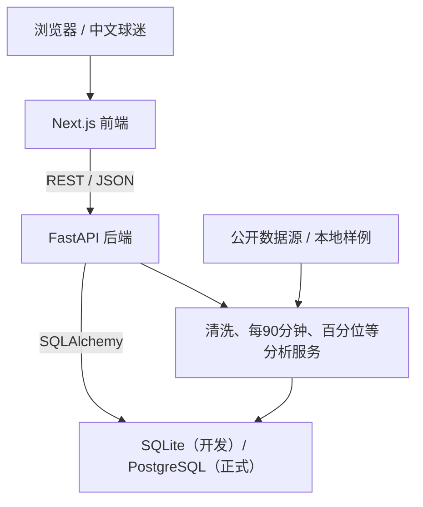

# PL Geo Analytics

> 英超地理探索与球员数据分析平台  
> Premier League Geo Analytics

面向中文英超球迷的交互式地理探索与数据分析平台。项目以“地图 → 球队 → 球员 → 对比 → 比赛事件”为主线，展示足球数据采集、清洗、存储、分析、可视化与 Web 开发能力。

## 当前进度

当前版本：`v0.2.0 / 阶段 2：测试数据和数据库`

- [x] Next.js + TypeScript + Tailwind CSS 前端骨架
- [x] FastAPI 后端骨架
- [x] `GET /api/health` 健康检查
- [x] 统一成功与错误响应结构
- [x] 前端后端连通状态展示
- [x] 环境变量示例
- [x] Windows 本地开发说明
- [x] SQLite + SQLAlchemy 数据层
- [x] Alembic 初始迁移
- [x] 球队、球员、积分榜、比赛与事件关系模型
- [x] 5 支球队、10 名球员与积分榜样例切片
- [x] 球队列表、球队详情与积分榜 API
- [x] 首页阶段 2 数据展示、加载、错误和重试状态
- [ ] 英格兰球队地图（阶段 3）
- [ ] 球队、积分榜、球员与比赛分析（后续阶段）

当前页面展示的是明确标记为 `sample` 的 2024-25
赛季小型结构演示切片，用于验证数据库、接口和前端数据流，不代表实时或完整的
20 队英超数据。

## 技术栈

| 层级 | 技术 |
| --- | --- |
| 前端 | Next.js、React、TypeScript、Tailwind CSS |
| 后端 | Python、FastAPI、Pydantic、SQLAlchemy、Alembic |
| 数据库 | SQLite（开发），通过 `DATABASE_URL` 保留 PostgreSQL 切换能力 |
| 后续可视化 | React Leaflet、Apache ECharts、mplsoccer、Matplotlib |

## 系统关系



- 前端只负责页面、交互和图表，不保存数据库密码，也不直接请求需要密钥的第三方足球 API。
- 后端统一完成数据校验、清洗、计算、缓存和数据库读写，再通过 `/api/*` 返回 JSON。
- 数据库只与后端连接；开发阶段可用 SQLite，后续通过环境变量切换 PostgreSQL。

## 项目结构

核心业务采用前后端分离结构：

```text
pl-geo-analytics/
├── frontend/              # Next.js 前端
├── backend/               # FastAPI 后端
├── data/                  # 原始、清洗、地理与示例数据
├── notebooks/             # 数据探索过程
├── scripts/               # 数据导入和维护脚本
├── docs/                  # 项目文档
├── .env.example           # 根级环境变量说明
├── .gitignore
├── PROJECT_PLAN.md
└── README.md
```

## 快速启动

完整的 Windows 逐步操作见 [docs/WINDOWS_SETUP.md](docs/WINDOWS_SETUP.md)。

### 1. 启动后端

```powershell
cd backend
py -3.12 -m venv .venv
Set-ExecutionPolicy -Scope Process -ExecutionPolicy Bypass
.\.venv\Scripts\Activate.ps1
python -m pip install --upgrade pip
pip install -r requirements.txt
Copy-Item .env.example .env
uvicorn app.main:app --reload --port 8000
```

首次启动时会自动建表并写入幂等样例数据。也可以手动执行：

```powershell
python -m app.database.init_db
```

验证地址：

- 健康检查：<http://127.0.0.1:8000/api/health>
- 球队列表：<http://127.0.0.1:8000/api/clubs>
- Liverpool 详情：<http://127.0.0.1:8000/api/clubs/liverpool>
- 积分榜切片：<http://127.0.0.1:8000/api/standings?season=2024-25>
- Swagger 文档：<http://127.0.0.1:8000/docs>

### 2. 启动前端

另开一个 PowerShell：

```powershell
cd frontend
npm ci
Copy-Item .env.example .env.local
npm run dev
```

打开 <http://localhost:3000>。页面应显示“后端连接正常”。

## 数据库命令

在 `backend/` 且虚拟环境已激活时运行：

```powershell
# 初始化本地数据库并检查样例数据
python -m app.database.init_db

# 按迁移升级数据库
alembic upgrade head

# 查看当前迁移版本
alembic current
```

日常启动后端不需要重复执行这些命令；初始化脚本是幂等的。

## 测试与构建

```powershell
# 后端测试：在 backend/ 中运行
pytest

# 前端检查：在 frontend/ 中运行
npm run lint
npm run build
```

## 数据规范

- `data/raw/`：保留原始数据，不直接修改。
- `data/processed/`：清洗后的可分析数据。
- `data/geo/`：地理边界、球场坐标等。
- `data/sample/`：可公开提交到 GitHub 的小型示例数据。
- 人工维护、公开来源、衍生指标和示例数据必须明确区分。
- 缺失值使用 `null` 或“暂无数据”，不能为了页面好看随意填 `0`。
- 密钥只写入本地 `.env` / `.env.local`，不得提交到 Git。

## Git 建议

- `main`：始终保持可运行。
- 每一阶段使用短期分支，例如 `chore/stage-01-init`、`feat/stage-02-data-api`。
- 分支合并后可以删除；阶段成果使用 Git 标签保留，例如 `v0.1.0`。

阶段 2 推荐提交：

```text
feat: add stage 2 football data API
```

## 许可证与数据来源

项目代码许可证和正式数据来源将在引入完整公开数据前确定。当前样例用于结构与界面验证，字段均带有
`source_kind=sample`。不要提交未经授权的官方徽章、球员照片或受版权保护的数据文件。
